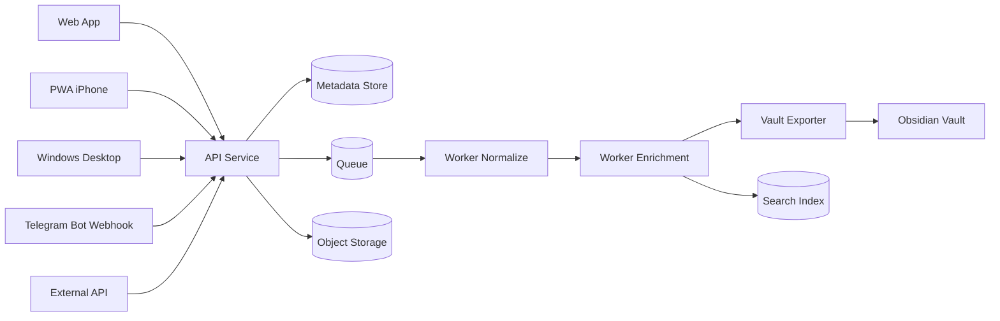
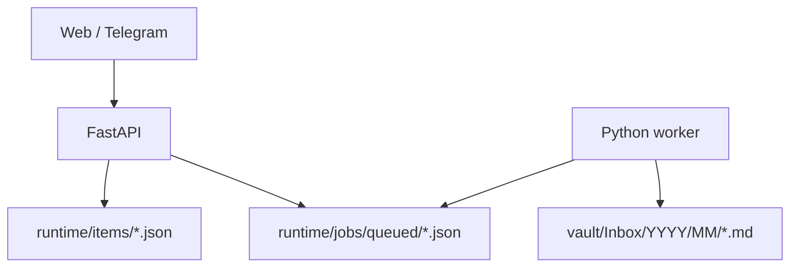
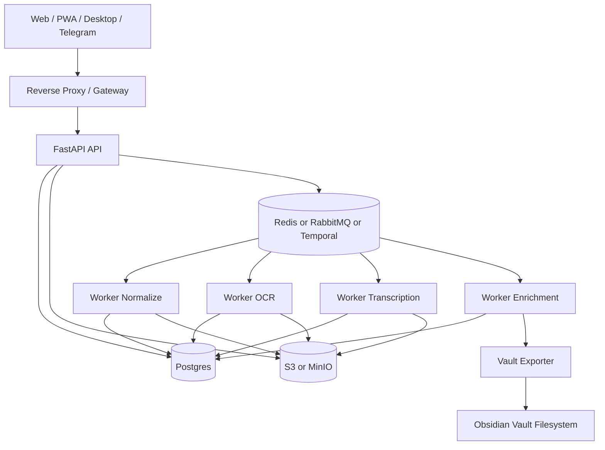

# Brain Vault - Detailed Technical Specification (VI)

**Tài liệu:** Đặc tả hệ thống chi tiết  
**Dự án:** Brain Vault / Personal Knowledge Capture Platform  
**Phiên bản:** 1.0  
**Ngày:** 2026-04-13  
**Ngôn ngữ:** Tiếng Việt  
**Trạng thái:** Draft dùng để triển khai MVP và mở rộng production  
**Repo bám theo:** `brain-vault-monorepo`

---

## 1. Tóm tắt điều hành

Brain Vault là một hệ thống thu thập, chuẩn hóa, phân tích và lưu trữ tri thức cá nhân.  
Mục tiêu của hệ thống là nhận dữ liệu từ nhiều nguồn:

- web app
- PWA trên iPhone
- app Windows
- Telegram bot
- API tích hợp ngoài

Sau khi nhận dữ liệu, hệ thống phải:

1. lưu bản gốc một cách an toàn
2. chuẩn hóa dữ liệu về một định dạng chung
3. chuyển đổi nội dung sang Markdown + metadata
4. phân tích nội dung để tạo summary, tags, entities, links
5. xuất dữ liệu thành một vault tương thích với Obsidian
6. cho phép truy xuất lại từ web app, Telegram và ứng dụng khác

Hệ thống này được thiết kế theo nguyên tắc:

- **server là nguồn sự thật duy nhất**
- **Obsidian vault là bản xuất hoặc materialized view**
- **mọi loại input đều đi qua cùng một pipeline xử lý**
- **Markdown + YAML frontmatter là định dạng chuẩn xuyên hệ thống**
- **raw data luôn được giữ lại để có thể tái xử lý trong tương lai**

---

## 2. Bối cảnh và mục tiêu sản phẩm

### 2.1 Bài toán cần giải quyết

Người dùng có nhu cầu lưu nhanh nhiều loại dữ liệu:

- đoạn text ngắn
- URL bài viết
- ảnh chụp màn hình
- ảnh chứa chữ
- video ngắn
- caption đi kèm media
- ý tưởng gửi qua Telegram
- nội dung từ web và điện thoại

Nếu chỉ lưu rời rạc trong Telegram, note app, thư mục file, bookmark và ảnh chụp, dữ liệu sẽ bị:

- phân mảnh
- khó tìm lại
- không đồng nhất định dạng
- không liên kết tri thức
- khó tái sử dụng trong long-term knowledge base

Brain Vault giải quyết bằng cách gom mọi dữ liệu vào một server trung tâm, biến dữ liệu thành tri thức có cấu trúc.

### 2.2 Mục tiêu chính

1. Thu thập dữ liệu cực nhanh từ nhiều thiết bị.
2. Chuẩn hóa mọi dữ liệu về Markdown + metadata.
3. Lưu được cả **raw asset** và **knowledge note**.
4. Tương thích tự nhiên với Obsidian.
5. Có thể tìm kiếm, lọc, gắn tag, liên kết note.
6. Có thể mở rộng thêm OCR, transcription, semantic search và AI enrichment.
7. Hỗ trợ vận hành từ quy mô cá nhân đến self-hosted production nhỏ.

### 2.3 Mục tiêu không thuộc giai đoạn đầu

Các mục sau **không bắt buộc trong MVP**, nhưng có thể nằm trong roadmap:

- collaborative multi-user real-time editing
- mobile native app riêng cho iOS/Android
- full two-way sync với Obsidian local edits
- distributed multi-region deployment
- RBAC phức tạp nhiều tổ chức
- workflow approval nhiều cấp
- live video streaming
- fine-grained version diff UI cho từng edit như GitHub

---

## 3. Đối tượng sử dụng và persona

### 3.1 Persona chính

#### Persona A - Founder / builder
- cần lưu ý tưởng nhanh
- thường gửi link, ảnh, video cho chính mình
- muốn tổng hợp thành second brain
- ưu tiên tốc độ capture hơn UI phức tạp

#### Persona B - Researcher / analyst
- lưu nhiều bài viết, notes, trích đoạn
- cần metadata, tags, full-text search
- cần xuất qua Obsidian để đọc và liên kết sâu

#### Persona C - Creator / operator
- thường gửi media từ điện thoại
- muốn Telegram là kênh nhập cực nhanh
- muốn web app để xem trạng thái xử lý
- muốn desktop app để kéo-thả file trên Windows

### 3.2 Use cases cốt lõi

1. Người dùng mở PWA trên iPhone, dán một link và bấm gửi.
2. Người dùng gửi một đoạn text vào Telegram bot để lưu ý tưởng.
3. Người dùng upload ảnh chụp màn hình có chữ để OCR và lưu.
4. Người dùng upload video ngắn để trích transcript và summary.
5. Worker phân tích, tạo note Markdown và đưa vào vault.
6. Người dùng mở web app để xem note đã xử lý.
7. Người dùng dùng Obsidian để duyệt dữ liệu đã được export.

---

## 4. Nguyên tắc kiến trúc

### 4.1 Quyết định kiến trúc bắt buộc

1. **Server là source of truth**
   - metadata, trạng thái xử lý, raw assets, jobs phải nằm ở server
   - không để Telegram, web app, desktop và Obsidian cùng chỉnh trực tiếp một vault file-system rồi tự xử lý conflict

2. **Vault Obsidian là output**
   - vault được tạo từ dữ liệu server
   - MVP chỉ hỗ trợ **one-way sync**: server -> vault
   - chưa đọc ngược mọi sửa đổi từ Obsidian về server

3. **Raw trước, knowledge sau**
   - luôn giữ raw data
   - normalization và enrichment có thể chạy lại bất kỳ lúc nào

4. **Markdown là lớp biểu diễn chuẩn**
   - mọi item sau xử lý đều có một note Markdown
   - metadata nằm trong YAML frontmatter
   - attachments nằm ngoài file `.md`

5. **Media lớn không nhét trực tiếp vào note**
   - file video, ảnh, audio được lưu ở object storage hoặc asset folder
   - note chỉ tham chiếu tới chúng bằng đường dẫn hoặc URL nội bộ

### 4.2 Triết lý phát triển

- làm được nhanh trong local trước
- tách ingest khỏi processing
- thiết kế idempotent để retry an toàn
- có thể thay engine xử lý mà không phá format đầu ra
- mô hình dữ liệu phải đủ chặt để mở rộng production

---

## 5. Phạm vi chức năng

### 5.1 Các chức năng trong MVP

- tạo item từ web app
- tạo item từ Telegram text hoặc caption
- tạo item từ API
- worker xử lý queue local
- export note Markdown vào vault tương thích Obsidian
- lưu metadata item theo file JSON local
- lưu trạng thái job queued / processing / processed / failed
- đọc danh sách item qua API
- xem chi tiết một item qua API

### 5.2 Các chức năng production target

- upload file binary thật
- object storage cho ảnh/video/file lớn
- Postgres cho metadata
- queue bền vững
- retry có chính sách
- MarkItDown integration để normalize nhiều loại file
- OCR ảnh
- transcription audio/video
- summary + entity extraction + auto-tag
- semantic search
- auth người dùng
- notification sau khi xử lý xong
- dashboard quản trị job và failure

---

## 6. Cấu trúc monorepo mục tiêu

Cấu trúc hiện có trong repo là nền tảng đúng và nên được giữ:

```text
brain-vault-monorepo/
  apps/
    web/
    desktop/
  services/
    api/
    worker/
    telegram-bot/
  packages/
    shared/
  vault/
    Inbox/
    Notes/
    Assets/
    Templates/
    .obsidian/
  runtime/
    items/
    jobs/
      queued/
      processed/
      failed/
  docs/
```

### 6.1 Vai trò từng thư mục

#### `apps/web`
Web app chính cho:
- nhập dữ liệu
- xem trạng thái item
- xem kết quả xử lý
- search, filter, retry job
- cài như PWA trên iPhone

#### `apps/desktop`
Tauri wrapper cho Windows:
- dùng lại frontend web
- hỗ trợ drag-and-drop file
- tích hợp shell/file picker
- deep link mở item hoặc note

#### `services/api`
FastAPI service:
- nhận ingest request
- validate payload
- ghi item metadata
- xếp job vào queue
- trả response ngay cho client
- cung cấp endpoint đọc item và status

#### `services/worker`
Background processor:
- đọc queue
- normalize item
- chạy enrichment
- export Markdown
- cập nhật trạng thái

#### `services/telegram-bot`
Webhook receiver:
- nhận Telegram update
- xác thực secret token
- map message/caption/file thành item
- gọi API nội bộ để tạo item

#### `packages/shared`
Shared contracts:
- TypeScript types
- API DTO
- validation schema frontend
- enums chung giữa web và desktop

#### `vault`
Output folder tương thích Obsidian:
- `Inbox/`: note mới tạo
- `Notes/`: note đã curate
- `Assets/`: media và attachment
- `Templates/`: template phục vụ note generation
- `.obsidian/`: cấu hình dành cho Obsidian

#### `runtime`
Chỉ dùng cho dev/MVP local:
- item metadata local
- queue local
- artifacts tạm

---

## 7. Kiến trúc tổng thể

### 7.1 Sơ đồ logic



### 7.2 Sơ đồ triển khai local MVP



### 7.3 Sơ đồ triển khai production target



---

## 8. Thành phần chức năng chi tiết

## 8.1 Web App

### 8.1.1 Mục tiêu
Web app là điểm vào chính để:
- capture nhanh
- theo dõi item
- xem trạng thái
- mở link tới note
- tìm kiếm dữ liệu

### 8.1.2 Màn hình tối thiểu
1. **Capture page**
2. **Items list**
3. **Item detail**
4. **Jobs dashboard**
5. **Search page**
6. **Settings / integrations**

### 8.1.3 Capture form yêu cầu
Form hiện tại đã có các field nền tảng:
- `type`
- `title`
- `content`
- `original_url`
- `tags`

Mở rộng target:
- file upload
- drag and drop
- paste event auto-detect URL hoặc text
- preview asset
- source auto = `web` hoặc `pwa`
- save draft local nếu offline

### 8.1.4 Hành vi UX
- gửi request không chặn UI quá lâu
- trả item id ngay
- hiển thị status ban đầu là `queued`
- polling hoặc SSE để cập nhật trạng thái
- có nút copy item id, mở note, retry

### 8.1.5 PWA trên iPhone
Yêu cầu:
- cài được từ Safari Add to Home Screen
- có manifest và service worker
- hoạt động tốt ở chế độ standalone
- có icon app
- hỗ trợ queue local khi mất mạng
- sau khi có mạng thì sync lại
- có thể dùng camera/photo picker của trình duyệt
- có web push ở giai đoạn sau nếu cần thông báo job xong

### 8.1.6 Trạng thái offline
MVP:
- chỉ cần thông báo mất kết nối

Phase sau:
- local IndexedDB queue
- retry background khi online
- mapping local draft -> remote item id

---

## 8.2 App Windows

### 8.2.1 Mục tiêu
- bọc web app để dùng như app desktop
- hỗ trợ drag file nhanh
- tích hợp tốt với clipboard và file explorer

### 8.2.2 Công nghệ
- Tauri
- frontend dùng lại `apps/web`

### 8.2.3 Tính năng desktop phase sau
- global shortcut mở capture box
- watch clipboard
- context menu "Send to Brain Vault"
- drag folder hoặc nhiều file
- background tray icon
- auto-start tùy chọn

### 8.2.4 Không bắt buộc trong MVP
- native editor phức tạp
- sync engine local riêng
- native search index riêng trên Windows

---

## 8.3 Telegram Bot

### 8.3.1 Mục tiêu
Telegram là kênh nhập cực nhanh, ma sát thấp.

### 8.3.2 Input cần hỗ trợ
MVP:
- text message
- text có chứa URL
- caption text

Phase sau:
- photo
- document
- video
- voice
- forwarded message
- reply-to để nối ngữ cảnh

### 8.3.3 Mapping logic
- nếu message chỉ là URL -> `type = link`
- nếu message là text thường -> `type = text`
- nếu có photo + caption -> `type = image`
- nếu có video + caption -> `type = video`
- nếu có document -> xác định type theo MIME hoặc extension

### 8.3.4 Response của bot
MVP:
- xác nhận đã nhận
- trả `item_id`
- trả trạng thái `queued`

Phase sau:
- gửi summary khi xử lý xong
- gửi lỗi nếu job failed
- gửi link mở item trên web app

### 8.3.5 Bảo mật
- bắt buộc dùng webhook secret token
- validate IP hoặc reverse proxy allowlist nếu triển khai được
- log raw update có masking dữ liệu nhạy cảm

---

## 8.4 API Service

### 8.4.1 Vai trò
- gateway nội bộ cho mọi ingest
- nơi validate input
- nơi phát sinh `item_id`
- nơi phát sinh `job_id`
- nơi ghi metadata
- nơi cung cấp query API cho frontend

### 8.4.2 Nguyên tắc
- sync nhanh, xử lý nặng đưa sang worker
- response càng deterministic càng tốt
- idempotency support cho client retry
- có versioning endpoint: `/v1/...`

### 8.4.3 Trách nhiệm
- validate schema
- assign source
- chuẩn hóa tags cơ bản
- chống payload quá lớn
- generate hash/dedupe key
- enqueue workflow
- lưu audit trail

---

## 8.5 Worker Pipeline

### 8.5.1 Mục tiêu
Worker chịu trách nhiệm cho toàn bộ phần compute nặng.

### 8.5.2 Stages chuẩn
1. `ingest_received`
2. `raw_persisted`
3. `normalized`
4. `enriched`
5. `vault_exported`
6. `indexed`
7. `completed`

### 8.5.3 Chính sách thực thi
- mỗi stage phải idempotent
- stage có thể retry độc lập
- lưu lỗi chi tiết
- không sửa raw input gốc
- tạo artifact riêng cho từng bước nếu cần

### 8.5.4 Loại worker
- normalize worker
- OCR worker
- transcription worker
- enrichment worker
- vault exporter worker
- search indexer worker

MVP hiện có thể gom chung vào một worker Python.

---

## 8.6 Obsidian Vault Exporter

### 8.6.1 Vai trò
Biến dữ liệu đã xử lý thành note và asset theo format mà Obsidian đọc được ngay.

### 8.6.2 Quy tắc xuất vault
- note mới nằm ở `vault/Inbox/YYYY/MM`
- file đã curate có thể chuyển sang `vault/Notes/...`
- asset nằm ở `vault/Assets/YYYY/MM/DD/...`
- filename phải an toàn với file system
- note phải là UTF-8
- line ending chuẩn LF

### 8.6.3 Quy tắc link
- dùng Markdown link cho external URL
- dùng wikilink Obsidian cho liên kết nội bộ nếu đã có note tương ứng
- không được tạo broken link hàng loạt không kiểm soát

### 8.6.4 Quy tắc frontmatter
Bắt buộc có:
- `id`
- `type`
- `source`
- `created_at`
- `updated_at`
- `status`
- `tags`

Khuyến nghị có:
- `title`
- `original_url`
- `summary`
- `entities`
- `asset_paths`
- `canonical_hash`
- `language`
- `note_version`
- `pipeline_version`

---

## 9. Mô hình dữ liệu

## 9.1 Thực thể chính

### 9.1.1 Item
Item là bản ghi canonical cho mọi thứ được gửi vào hệ thống.

```json
{
  "id": "itm_01HXYZ...",
  "type": "text",
  "source": "telegram",
  "title": "Ý tưởng AI agent",
  "content": "Nội dung text hoặc caption",
  "original_url": null,
  "tags": ["telegram", "idea", "inbox"],
  "status": "processed",
  "created_at": "2026-04-13T09:00:00Z",
  "updated_at": "2026-04-13T09:01:20Z",
  "note_path": "vault/Inbox/2026/04/y-tuong-ai-agent-ab12cd34.md"
}
```

#### Fields đề xuất cho production
- `id`
- `type`
- `source`
- `title`
- `content`
- `original_url`
- `status`
- `created_at`
- `updated_at`
- `submitted_at`
- `processed_at`
- `language`
- `canonical_hash`
- `dedupe_key`
- `summary`
- `note_path`
- `note_id`
- `owner_user_id`
- `visibility`
- `pipeline_version`
- `error_code`
- `error_message`

### 9.1.2 Asset
Dùng cho file nhị phân.

```json
{
  "id": "ast_01HXYZ...",
  "item_id": "itm_01HXYZ...",
  "role": "original",
  "storage_kind": "s3",
  "path": "assets/2026/04/13/itm_01HXYZ/original.mp4",
  "mime_type": "video/mp4",
  "size_bytes": 12400000,
  "checksum_sha256": "....",
  "width": 1920,
  "height": 1080,
  "duration_ms": 45230,
  "created_at": "2026-04-13T09:00:05Z"
}
```

### 9.1.3 Job
```json
{
  "job_id": "job_01HXYZ...",
  "item_id": "itm_01HXYZ...",
  "workflow": "normalize_and_export",
  "stage": "enriched",
  "status": "processing",
  "attempt": 1,
  "created_at": "2026-04-13T09:00:02Z",
  "updated_at": "2026-04-13T09:00:15Z",
  "error": null
}
```

### 9.1.4 Note
```json
{
  "id": "note_01HXYZ...",
  "item_id": "itm_01HXYZ...",
  "vault_path": "Inbox/2026/04/idea-agent-ab12cd34.md",
  "title": "Idea agent",
  "frontmatter_version": 1,
  "content_hash": "....",
  "exported_at": "2026-04-13T09:01:10Z"
}
```

### 9.1.5 EntityLink
Thực thể liên kết tri thức.

```json
{
  "id": "lnk_01HXYZ...",
  "from_note_id": "note_01...",
  "to_note_id": "note_02...",
  "link_type": "related",
  "score": 0.83,
  "created_at": "2026-04-13T09:01:11Z"
}
```

---

## 9.2 Enum chuẩn

### 9.2.1 `ItemType`
- `text`
- `link`
- `image`
- `video`
- phase sau có thể thêm:
  - `document`
  - `audio`
  - `html`
  - `pdf`

### 9.2.2 `ItemSource`
- `web`
- `pwa`
- `windows`
- `telegram`
- `api`

### 9.2.3 `ItemStatus`
- `queued`
- `processing`
- `processed`
- `failed`
- phase sau:
  - `duplicate`
  - `needs_review`
  - `archived`

### 9.2.4 `AssetRole`
- `original`
- `thumbnail`
- `preview`
- `transcript`
- `ocr_text`
- `derived_markdown`

---

## 9.3 Frontmatter spec

### 9.3.1 Frontmatter tối thiểu
```yaml
---
id: itm_01HXYZ
type: text
source: telegram
title: Y tuong AI agent
created_at: 2026-04-13T09:00:00Z
updated_at: 2026-04-13T09:01:20Z
tags:
  - telegram
  - idea
  - inbox
status: processed
original_url:
---
```

### 9.3.2 Frontmatter đầy đủ khuyến nghị
```yaml
---
id: itm_01HXYZ
note_id: note_01HXYZ
type: video
source: web
title: Demo retrieval pipeline
created_at: 2026-04-13T09:00:00Z
updated_at: 2026-04-13T09:02:10Z
processed_at: 2026-04-13T09:02:09Z
status: processed
tags:
  - inbox
  - ai
  - demo
entities:
  - MarkItDown
  - Obsidian
language: vi
original_url: https://example.com/video
summary: Video nói về pipeline normalize dữ liệu.
asset_paths:
  - Assets/2026/04/13/itm_01HXYZ/original.mp4
  - Assets/2026/04/13/itm_01HXYZ/thumb.jpg
canonical_hash: sha256:...
pipeline_version: 1
note_version: 1
---
```

---

## 10. Định dạng note Markdown

## 10.1 Template chuẩn

```md
---
id: itm_01HXYZ
type: link
source: telegram
title: Bai viet ve knowledge graph
created_at: 2026-04-13T09:00:00Z
updated_at: 2026-04-13T09:01:00Z
tags:
  - inbox
  - article
status: processed
original_url: https://example.com/article
summary: Bai viet mo ta cach xay knowledge graph ca nhan.
---

# Bai viet ve knowledge graph

## Summary
Bai viet mo ta...

## Source
https://example.com/article

## Extracted Content
Noi dung da duoc chuyen doi sang Markdown...

## Entities
- [[Knowledge Graph]]
- [[Obsidian]]
- [[Personal Knowledge Management]]

## Assets
- None

## Processing Notes
- normalized by pipeline version 1
- exported from server source of truth
```

## 10.2 Quy tắc sinh title
Ưu tiên theo thứ tự:
1. title người dùng nhập
2. title trích từ trang web
3. title suy ra từ caption hoặc transcript
4. fallback: `Untitled <type>`

## 10.3 Quy tắc file name
- bỏ ký tự nguy hiểm
- chuyển space thành `-`
- giới hạn độ dài tối đa 120 ký tự
- luôn gắn suffix ngắn từ item id để tránh trùng

Ví dụ:
`Demo retrieval pipeline-itm01hxyz.md`

---

## 11. Pipeline xử lý theo loại dữ liệu

## 11.1 Text

### Input
- text thuần từ web
- text từ Telegram
- text từ API

### Normalize
- trim whitespace
- detect language
- chuẩn hóa newline
- nếu text quá ngắn thì không cần summarize mạnh

### Enrich
- auto-tag
- entity extraction
- summary ngắn
- detect duplicates theo hash

### Output
- note Markdown
- metadata item cập nhật
- possible internal links

---

## 11.2 Link

### Input
- URL dán trực tiếp
- text chứa URL
- Telegram message chỉ gồm URL

### Normalize
- fetch nội dung HTML
- lưu `original_url`
- trích title, og:title, meta description
- convert content sang Markdown
- snapshot text extract để tránh link chết trong tương lai

### Enrich
- summary bài viết
- domain extraction
- keyword tagging
- dedupe theo canonical URL + content hash

### Output
- note Markdown có source URL
- optional archived html/text asset

### Failure cases
- URL không truy cập được
- anti-bot hoặc paywall
- nội dung quá ít
- MIME không phải HTML

Trong các trường hợp này vẫn phải tạo note với trạng thái `processed` hoặc `needs_review` tùy chính sách, và ghi rõ lỗi normalize.

---

## 11.3 Image

### Input
- upload file ảnh
- Telegram photo
- screenshot paste từ web app

### Normalize
- lưu file gốc
- lấy metadata ảnh
- tạo thumbnail
- OCR nếu ảnh có chữ
- caption hóa nếu có model hỗ trợ

### Enrich
- summary nội dung ảnh
- detect screenshot / photo / document
- tag tự động

### Output
- note Markdown
- asset original
- asset thumbnail
- OCR text nếu có

### Chú ý
- OCR không được ghi đè caption người dùng
- note phải phân biệt rõ giữa "caption user viết" và "text OCR trích xuất"

---

## 11.4 Video

### Input
- upload video
- Telegram video
- URL video được hỗ trợ

### Normalize
- lưu file gốc
- lấy duration, resolution, codec metadata
- tạo thumbnail
- trích transcript nếu có audio
- nếu không có transcript, ít nhất ghi metadata và caption

### Enrich
- summary
- chapter suggestions
- tags
- entity extraction

### Output
- note Markdown
- transcript asset hoặc embedded section
- thumbnail
- original video path

### Chú ý
- video thường nặng, không chặn request sync
- upload và processing phải tách rời
- note không nên embed toàn bộ binary

---

## 11.5 Tài liệu và định dạng mở rộng trong phase sau

Khi tích hợp lớp normalize theo hướng MarkItDown-compatible, hệ thống nên hỗ trợ thêm:
- PDF
- DOCX
- XLSX
- PPTX
- HTML
- audio
- các file text giàu định dạng khác

Định hướng là:
- converter trả về Markdown chuẩn
- raw asset vẫn được giữ nguyên
- note chỉ tham chiếu đến output normalize

---

## 12. Quy tắc dedupe và idempotency

## 12.1 Dedupe
Hệ thống phải tránh tạo nhiều item trùng hoàn toàn.

### Key đề xuất
- text: `sha256(normalized_text)`
- link: `sha256(canonical_url)` và thêm `content_hash`
- image/video: checksum file + source message id nếu có
- Telegram: `chat_id + message_id`
- web form: client-generated idempotency key nếu có

### Chính sách
- nếu trùng hoàn toàn: đánh dấu `duplicate_of`
- vẫn có thể cho phép lưu mới nếu user chọn `force_save`

## 12.2 Idempotency API
`POST /v1/items` nên hỗ trợ header:
- `Idempotency-Key`

Server sẽ:
- tìm request cũ theo key
- nếu đã xử lý trước đó thì trả lại item cũ
- tránh tạo trùng khi client retry do timeout

---

## 13. API specification

## 13.1 Endpoint hiện có trong scaffold

### `GET /health`
Dùng để health check.

Response:
```json
{"status":"ok"}
```

### `GET /v1/items`
Lấy danh sách item.

Query:
- `limit` mặc định 20

### `GET /v1/items/{item_id}`
Lấy chi tiết một item.

### `POST /v1/items`
Tạo item mới.

Request:
```json
{
  "type": "text",
  "source": "web",
  "title": "Quick note",
  "content": "Noi dung",
  "original_url": null,
  "tags": ["inbox"]
}
```

Response:
```json
{
  "id": "....",
  "type": "text",
  "source": "web",
  "title": "Quick note",
  "content": "Noi dung",
  "original_url": null,
  "tags": ["inbox"],
  "status": "queued",
  "created_at": "....",
  "updated_at": "....",
  "note_path": null
}
```

---

## 13.2 Endpoint target cho MVP mở rộng

### `POST /v1/uploads/init`
Tạo upload session cho file lớn.

Request:
```json
{
  "filename": "demo.mp4",
  "mime_type": "video/mp4",
  "size_bytes": 12400000
}
```

Response:
```json
{
  "upload_id": "upl_...",
  "storage_path": "assets/2026/04/13/...",
  "signed_url": "..."
}
```

### `POST /v1/items/from-upload`
Tạo item từ asset đã upload.

### `GET /v1/jobs/{job_id}`
Xem trạng thái job.

### `POST /v1/jobs/{job_id}/retry`
Retry job failed.

### `GET /v1/search`
Tìm kiếm item và note.

Query:
- `q`
- `type`
- `tag`
- `status`
- `source`
- `date_from`
- `date_to`

### `GET /v1/notes/{item_id}`
Lấy note đã render hoặc metadata của note.

### `POST /v1/webhooks/telegram`
Webhook nội bộ hoặc public endpoint cho Telegram.

---

## 13.3 Chuẩn lỗi API

```json
{
  "error": {
    "code": "ITEM_NOT_FOUND",
    "message": "Item not found",
    "details": null
  }
}
```

### Mã lỗi gợi ý
- `INVALID_PAYLOAD`
- `UNSUPPORTED_TYPE`
- `UNAUTHORIZED`
- `FORBIDDEN`
- `ITEM_NOT_FOUND`
- `UPLOAD_TOO_LARGE`
- `UNSUPPORTED_MEDIA_TYPE`
- `JOB_NOT_FOUND`
- `DUPLICATE_ITEM`
- `INTERNAL_ERROR`

---

## 14. Job workflow specification

## 14.1 Mô hình hàng đợi

### Local MVP
- queue file JSON tại `runtime/jobs/queued`
- worker đọc tuần tự
- sau thành công move sang `processed`
- sau thất bại move sang `failed`

### Production
- Redis queue, RabbitMQ hoặc Temporal
- retry policy có backoff
- DLQ cho job lỗi nhiều lần
- metrics theo stage

## 14.2 Retry policy
Khuyến nghị:
- attempt 1: chạy ngay
- attempt 2: sau 30 giây
- attempt 3: sau 5 phút
- attempt 4: sau 30 phút
- quá số lần -> `failed`

## 14.3 Idempotent stages
Mỗi stage phải kiểm tra:
- artifact đã tồn tại chưa
- checksum có thay đổi không
- output stage cũ có hợp lệ không

## 14.4 Failure handling
Lỗi phải được phân loại:
- permanent error
- transient error
- external dependency error
- unsupported input
- corrupted file

Mỗi lỗi phải lưu:
- `error_code`
- `error_message`
- `stacktrace` nội bộ
- `failed_stage`
- `attempt_count`

---

## 15. Lưu trữ và đồng bộ

## 15.1 Local dev storage
- item metadata: `runtime/items/*.json`
- jobs: `runtime/jobs/...`
- notes: `vault/Inbox/...`
- assets: `vault/Assets/...` hoặc local temp folder

## 15.2 Production storage
- metadata: Postgres
- assets: S3 hoặc MinIO
- queue: Redis/RabbitMQ/Temporal
- vault export: local mounted volume hoặc network share
- search index: Postgres FTS hoặc engine riêng

## 15.3 Quy tắc đồng bộ với vault
MVP:
- chỉ export một chiều
- chỉnh sửa trong Obsidian không tự sync ngược

Phase sau nếu cần hai chiều:
- phải có file watcher
- phải parse lại frontmatter
- phải có conflict policy
- phải định nghĩa field nào server-owned, field nào user-editable

### Chính sách đề xuất nếu triển khai hai chiều sau này
- server-owned:
  - `id`
  - `type`
  - `source`
  - `created_at`
  - `canonical_hash`
- user-editable:
  - `title`
  - `tags`
  - `summary`
  - nội dung body section do user ghi chú thêm

---

## 16. Tích hợp lớp normalize theo hướng MarkItDown-compatible

## 16.1 Mục tiêu
Một lớp normalize chung phải nhận nhiều kiểu input và trả ra:
- Markdown text
- metadata extract
- asset derivatives nếu cần

## 16.2 Contract của normalize layer
Input:
```json
{
  "item_id": "itm_...",
  "type": "link",
  "raw_ref": "...",
  "mime_type": "text/html",
  "options": {
    "ocr": true,
    "transcribe": true
  }
}
```

Output:
```json
{
  "markdown": "# Tieu de\n\nNoi dung...",
  "summary": "Tom tat...",
  "language": "vi",
  "entities": ["Obsidian", "Markdown"],
  "derived_assets": [],
  "warnings": []
}
```

## 16.3 Nguyên tắc tích hợp
- normalize không được thay đổi item gốc
- output normalize phải versioned
- có thể thay converter engine mà không đổi API contract

---

## 17. Search và retrieval

## 17.1 MVP
- list item
- filter theo type/source/status/tag
- search đơn giản theo title/content bằng Postgres FTS hoặc naive scan trong local

## 17.2 Production target
- full text search
- search theo metadata
- semantic search theo embeddings
- hybrid search
- filter theo thời gian, nguồn, loại asset, entity

## 17.3 Kết quả search cần trả
- item id
- title
- type
- source
- created_at
- summary snippet
- note path
- match highlights

---

## 18. Bảo mật

## 18.1 Mức bảo mật tối thiểu
- HTTPS bắt buộc ở production
- secrets nằm trong environment variables
- Telegram secret token bắt buộc
- giới hạn kích thước upload
- MIME validation
- sanitize filename
- rate limit endpoint công khai
- audit log cho action quan trọng

## 18.2 Auth
MVP local có thể chưa cần auth.

Production:
- web/desktop dùng session hoặc JWT
- API public dùng API key hoặc OAuth proxy
- role tối thiểu:
  - admin
  - user

## 18.3 Asset security
- không expose bucket công khai bừa bãi
- dùng signed URL cho download nội bộ nếu cần
- scan malware cho file upload trong phase production
- không render trực tiếp HTML không sanitize

## 18.4 Privacy
- raw private data phải được bảo vệ
- log không được in toàn bộ nội dung nhạy cảm trong production
- transcript/video/image có thể chứa thông tin riêng tư, cần retention policy

---

## 19. Hiệu năng và yêu cầu phi chức năng

## 19.1 Performance target
### Ingest API
- p95 response cho `POST /v1/items` nhỏ hơn 500ms với text/link nhỏ
- upload init nhỏ hơn 300ms
- không chờ summary/transcription trong request sync

### Worker
- text/link đơn giản: hoàn tất dưới 10 giây trong môi trường bình thường
- image OCR: dưới 60 giây
- video ngắn: phụ thuộc pipeline, có thể hàng phút

## 19.2 Scalability
- web và API scale horizontal
- worker scale theo queue depth
- object storage scale độc lập
- vault export nên tách khỏi ingest path

## 19.3 Reliability
- raw asset phải được lưu trước khi báo success cho upload
- job phải retry được sau restart
- mất worker không làm mất item
- metadata và asset backup định kỳ

## 19.4 Maintainability
- strict schemas
- logs có cấu trúc
- module tách rõ
- mỗi service có README riêng
- test cho từng stage

---

## 20. Logging, metrics, observability

## 20.1 Logging
Mỗi request hoặc job nên có:
- request_id
- item_id
- job_id
- source
- stage
- status
- duration_ms
- error_code

## 20.2 Metrics
- number of created items
- queue depth
- average processing time
- failure rate theo stage
- dedupe hit rate
- upload size distribution
- OCR/transcription success rate

## 20.3 Tracing
Phase sau:
- OpenTelemetry cho API -> queue -> worker
- trace per item pipeline

---

## 21. Cấu hình môi trường

## 21.1 Biến môi trường đề xuất

### Chung
- `APP_ENV`
- `LOG_LEVEL`
- `BASE_URL`

### API
- `API_HOST`
- `API_PORT`
- `DATA_DIR`
- `DATABASE_URL`
- `OBJECT_STORAGE_ENDPOINT`
- `OBJECT_STORAGE_BUCKET`
- `OBJECT_STORAGE_KEY`
- `OBJECT_STORAGE_SECRET`

### Web
- `NEXT_PUBLIC_API_BASE_URL`

### Telegram
- `TELEGRAM_BOT_TOKEN`
- `TELEGRAM_SECRET_TOKEN`
- `API_BASE_URL`

### Worker
- `QUEUE_BACKEND`
- `VAULT_ROOT`
- `TEMP_DIR`
- `PIPELINE_VERSION`

---

## 22. Chuẩn hóa thư mục vault

## 22.1 Cấu trúc đề xuất

```text
vault/
  Inbox/
    2026/
      04/
        some-note-ab12cd34.md
  Notes/
    Concepts/
    Journal/
    Projects/
    References/
  Assets/
    2026/
      04/
        13/
          itm_01HXYZ/
            original.mp4
            thumb.jpg
            transcript.txt
  Templates/
    capture-template.md
  .obsidian/
```

## 22.2 Chính sách di chuyển note
- note mới luôn vào Inbox
- việc chuyển sang Notes có thể do user hoặc curator job
- khi di chuyển, `note_id` không đổi
- `note_path` trong metadata phải cập nhật

---

## 23. Thiết kế UI/UX chức năng chính

## 23.1 Capture flow
1. user chọn type hoặc auto-detect
2. user nhập title/content/url hoặc chọn file
3. user thêm tags
4. bấm gửi
5. UI nhận item id và trạng thái queued
6. UI hiển thị progression:
   - queued
   - processing
   - processed / failed
7. user bấm mở note hoặc retry

## 23.2 Item list
Mỗi dòng nên có:
- title
- type
- source
- tags
- status
- created_at
- nút open / retry / copy id

## 23.3 Item detail
Các section:
- metadata
- raw content
- normalized output
- summary
- entities
- note path
- job history
- error details nếu có

---

## 24. Kiểm thử

## 24.1 Unit test
- schema validation
- filename sanitizer
- frontmatter renderer
- markdown renderer
- dedupe hash generator
- Telegram payload parser

## 24.2 Integration test
- create item -> queue -> worker -> note exported
- link item có URL -> normalized -> note
- failed job được move đúng thư mục
- Telegram webhook -> API create item

## 24.3 End-to-end test
- mở web app, gửi item, xem item status đổi sang processed
- gửi Telegram message, item xuất hiện trên web app
- exported note mở được trong Obsidian

## 24.4 Acceptance criteria theo scenario

### Scenario A - Text from web
- khi submit text
- item được tạo với status `queued`
- worker xử lý xong
- note `.md` xuất hiện trong `vault/Inbox/YYYY/MM`
- frontmatter hợp lệ
- content body chứa text gốc

### Scenario B - Link from Telegram
- bot nhận message URL
- item type = `link`
- item source = `telegram`
- note có `original_url`
- nếu không fetch được nội dung, vẫn lưu lại link và trạng thái rõ ràng

### Scenario C - Failed processing
- khi worker lỗi
- item status = `failed`
- job move vào failed queue
- error message được lưu
- có thể retry

---

## 25. Lộ trình triển khai

## Phase 0 - Scaffold hiện tại
- web capture form
- API create/list/get item
- local queue
- local worker
- vault export đơn giản
- Telegram text ingest

## Phase 1 - MVP usable
- upload file cơ bản
- item detail UI
- jobs dashboard
- retry failed jobs
- better Markdown template
- asset folder organization

## Phase 2 - Normalize engine
- integrate converter theo hướng MarkItDown-compatible
- HTML to Markdown
- document to Markdown
- OCR image
- transcript video/audio

## Phase 3 - Productionize
- Postgres
- S3/MinIO
- real queue
- auth
- rate limit
- observability
- search

## Phase 4 - Knowledge enrichment
- auto-summary
- auto-tags
- entity extraction
- wikilink suggestions
- semantic search

## Phase 5 - Optional advanced sync
- read-back from Obsidian
- conflict policy
- sync status dashboard

---

## 26. Rủi ro và quyết định còn mở

## 26.1 Rủi ro kỹ thuật
- hai chiều sync với Obsidian dễ gây conflict
- OCR/transcription tăng chi phí và độ trễ
- Telegram media handling có thể phức tạp do download/upload lifecycle
- asset lớn khiến backup và storage tốn chi phí
- normalize chất lượng kém sẽ tạo ra note rác

## 26.2 Quyết định cần chốt sớm
1. dùng local file queue hay chuyển sớm sang Redis
2. object storage local là filesystem hay MinIO
3. search MVP dùng Postgres FTS hay chỉ scan local
4. summary/entity extraction chạy local model hay external service
5. có cho user sửa note body trên web app không
6. retention policy cho raw video và transcript
7. naming policy cho vault path và folder taxonomy

---

## 27. Backlog kỹ thuật ưu tiên cao

1. thêm upload endpoint
2. tách asset store khỏi item metadata
3. mở rộng schema `ItemRecord`
4. thêm `job history`
5. thêm `retry` endpoint
6. thêm `failed reason`
7. thêm `note preview`
8. thêm `search`
9. thêm auth
10. thêm configuration management chặt hơn

---

## 28. Đề xuất implementation khớp với repo hiện có

### 28.1 `services/api`
Bổ sung:
- `routes/jobs.py`
- `routes/search.py`
- `routes/uploads.py`
- `services/hash.py`
- `services/dedupe.py`
- `services/assets.py`

### 28.2 `services/worker`
Bổ sung module:
- `pipeline/normalize.py`
- `pipeline/enrich.py`
- `pipeline/ocr.py`
- `pipeline/transcribe.py`
- `pipeline/export.py`
- `pipeline/index.py`

### 28.3 `apps/web`
Bổ sung page:
- `/items`
- `/items/[id]`
- `/jobs`
- `/search`

### 28.4 `packages/shared`
Bổ sung:
- DTO types
- API response types
- status enum
- filter types

---

## 29. Ví dụ lifecycle đầy đủ

### 29.1 Link từ iPhone PWA
1. user mở PWA
2. dán URL bài viết
3. app gọi `POST /v1/items`
4. API tạo item + job
5. worker fetch trang, convert sang Markdown
6. enrichment tạo summary
7. exporter ghi note vào `vault/Inbox/2026/04/...md`
8. web app hiển thị `processed`
9. user mở Obsidian và thấy note mới

### 29.2 Ý tưởng gửi qua Telegram
1. user gửi text cho bot
2. webhook nhận update
3. bot service gọi API
4. API tạo item `source=telegram`
5. worker export note
6. bot trả item id hoặc link tới web app
7. note xuất hiện trong vault

### 29.3 Video upload từ Windows
1. user kéo file vào app desktop
2. desktop app upload asset
3. API tạo item từ upload session
4. worker lấy metadata video
5. transcription worker tạo transcript
6. enrichment worker tóm tắt
7. exporter tạo note và thumbnail
8. item status thành `processed`

---

## 30. Kết luận kỹ thuật

Định hướng đúng cho dự án này là:

- dùng **server làm trung tâm**
- dùng **Markdown + frontmatter** làm chuẩn dữ liệu
- dùng **vault Obsidian như lớp trình bày tri thức**
- giữ **raw asset + processed note** song song
- thiết kế **pipeline worker tách rời ingest**
- bắt đầu từ **local JSON + file queue** để đi nhanh
- sau đó nâng cấp dần lên **Postgres + object storage + queue bền vững**

Repo scaffold hiện tại đã đi đúng hướng và đặc tả này được viết để:
- không phá cấu trúc đang có
- đủ rõ để bạn hoặc team bắt đầu code tiếp
- đủ chặt để chuyển dần sang production

---

## 31. Phụ lục A - Schema tối thiểu hiện tại

Hiện scaffold đang có schema tối thiểu như sau:

```python
ItemType = Literal["text", "link", "image", "video"]
ItemSource = Literal["web", "pwa", "windows", "telegram", "api"]

class CreateItemInput(BaseModel):
    type: ItemType
    source: ItemSource = "api"
    title: str | None = None
    content: str | None = None
    original_url: str | None = None
    tags: list[str] = Field(default_factory=list)

class ItemRecord(CreateItemInput):
    id: str
    status: Literal["queued", "processing", "processed", "failed"]
    created_at: str
    updated_at: str
    note_path: str | None = None
```

Khuyến nghị bước kế tiếp là mở rộng schema này theo phần 9 của tài liệu.

---

## 32. Phụ lục B - Mẫu note đầu ra khuyến nghị cho scaffold

```md
---
id: itm_demo_001
type: text
source: web
title: Quick idea about AI memory
created_at: 2026-04-13T09:00:00Z
updated_at: 2026-04-13T09:00:10Z
tags:
  - inbox
  - idea
status: processed
original_url:
summary: Ghi chú nhanh về cách lưu memory trong knowledge system.
---

# Quick idea about AI memory

## Summary
Ghi chú nhanh về cách lưu memory trong knowledge system.

## Content
Nên cho mọi nguồn dữ liệu đi qua cùng một normalize pipeline trước khi đưa vào Obsidian.

## Entities
- [[AI Memory]]
- [[Obsidian]]
- [[Markdown]]

## Processing Notes
- created from scaffold worker
- ready for enrichment in next phase
```

---

## 33. Phụ lục C - Checklist bàn giao cho dev

### Backend
- [ ] mở rộng item schema
- [ ] tách asset store
- [ ] thêm upload
- [ ] thêm jobs API
- [ ] thêm retry
- [ ] thêm dedupe
- [ ] thêm structured logs

### Worker
- [ ] normalize stage
- [ ] enrich stage
- [ ] export stage
- [ ] failed handling
- [ ] retry policy

### Frontend
- [ ] items list
- [ ] item detail
- [ ] search
- [ ] error states
- [ ] offline handling

### Telegram
- [ ] text
- [ ] URL
- [ ] photo
- [ ] video
- [ ] better response message

### Vault
- [ ] stable naming
- [ ] asset folder policy
- [ ] template upgrade
- [ ] internal links strategy

---

Hết tài liệu.
